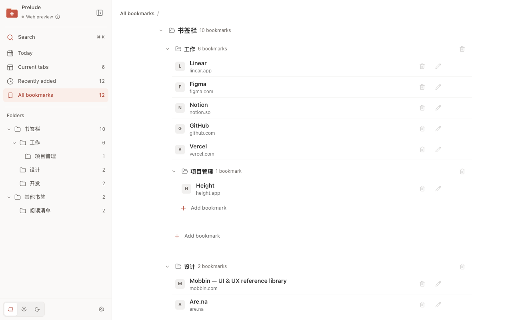

# Prelude · New Tab

[English](./README.md) · [简体中文](./README.zh-CN.md)

> A calm new tab for organizing Chrome bookmarks, open tabs, and Read later.

Prelude makes your Chrome new-tab page a home for the pages you use every day. Open a bookmark, find a tab from another window, or pick up something you saved for later. It works directly with your existing Chrome bookmarks, so your folders stay familiar.

## Your bookmarks, ready when you are

Keep your Chrome bookmark folders and organize them right from a new tab. Add, edit, delete, or reorder pages without maintaining a second collection. **Today** brings Pinned, Read later, and Favorites together; **Recently added** helps you find a page you just saved.

## Pick up where you left off

See open tabs across your browser windows. Switch to a page, close a finished tab, or drag tabs into a different order or window. Search bookmarks and open tabs together; enter an address to open it, or submit a query to Chrome's default search engine.

## Save it for later

Save the current page, an entire window, or a tab group to **Read later** from the toolbar or page context menu. The default `Alt + Shift + S` shortcut saves the current page. Prelude preserves tab order and checks for duplicate URLs. Turn on **Close after saving** to clear the tabs that were successfully saved.

Missing bookmark titles are completed automatically when possible, while titles you enter yourself are preserved.

## Made to stay out of the way

Choose a light, dark, or system theme. The sidebar adapts to smaller windows, and the interface is available in Simplified Chinese, English, Japanese, Spanish, French, and Russian.

No account to create, no ads, and no analytics. Prelude processes bookmark and tab data locally. Your bookmarks remain ordinary Chrome bookmarks and follow your own Chrome Sync settings. Web searches you submit are passed by Chrome to your configured default search provider.

[中文产品介绍](./README.zh-CN.md) · [Privacy policy](./PRIVACY.md) · [Support and feedback](https://github.com/yuzhouu/supposed/issues)
