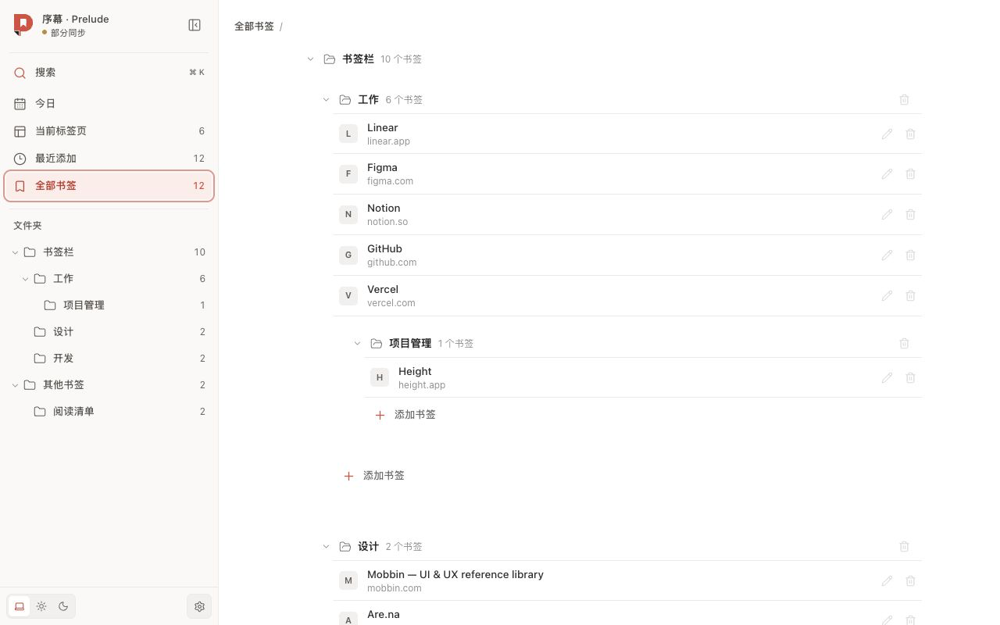

# 序幕 · Prelude

[English](./README.md) · [简体中文](./README.zh-CN.md)

> 江流天地外，山色有无中

序幕是一款 Chrome 新标签页扩展，把书签、当前标签页和“待读”收进一个安静、专注的工作台。它直接使用你已有的 Chrome 数据，保留原本的书签层级，并让浏览数据留在浏览器中。

## 每次打开浏览器，都从清楚的一页开始

保存的网页和打开的标签页不该被层层埋住。序幕为它们提供一个安静、有条理的位置：

- **今日**集中呈现置顶、待读与收藏内容，让每天要处理的页面一目了然。
- **书签**保留 Chrome 原有的文件夹层级，可以直接新增、编辑、删除与拖动整理。
- **当前标签页**汇总各个浏览器窗口中的页面，可以切换、关闭，也可以拖动排序或移到其他窗口。
- **最近添加**帮助你快速找回刚刚保存的页面。
- **统一搜索**同时查找书签与当前标签页；网址直接打开，其他内容交给 Chrome 默认搜索引擎。

## 先收集，稍后再决定

你可以通过扩展工具栏、页面右键菜单或 `Alt + Shift + S`，把当前页面、整个窗口或标签组保存到“待读”。序幕会保留原有标签顺序、检查重复网址，也可以只关闭本次成功保存的标签页。

新书签缺少标题时，序幕会在可行时自动补全；你亲自填写或修改过的标题始终会被保留。

## 安静地融入日常

序幕支持浅色、深色和跟随系统主题，拥有适配窄屏的紧凑侧栏，并提供简体中文、English、日本語、Español、Français 和 Русский 界面。

序幕没有账号、远程服务、分析工具或广告。书签与标签页数据留在浏览器中；书签仍是普通 Chrome 书签，并遵循你自己的 Chrome 同步设置。只有你主动提交的网页搜索会由 Chrome 交给当前配置的默认搜索引擎。

[隐私政策](./PRIVACY.md) · [支持与反馈](https://github.com/yuzhouu/supposed/issues)
